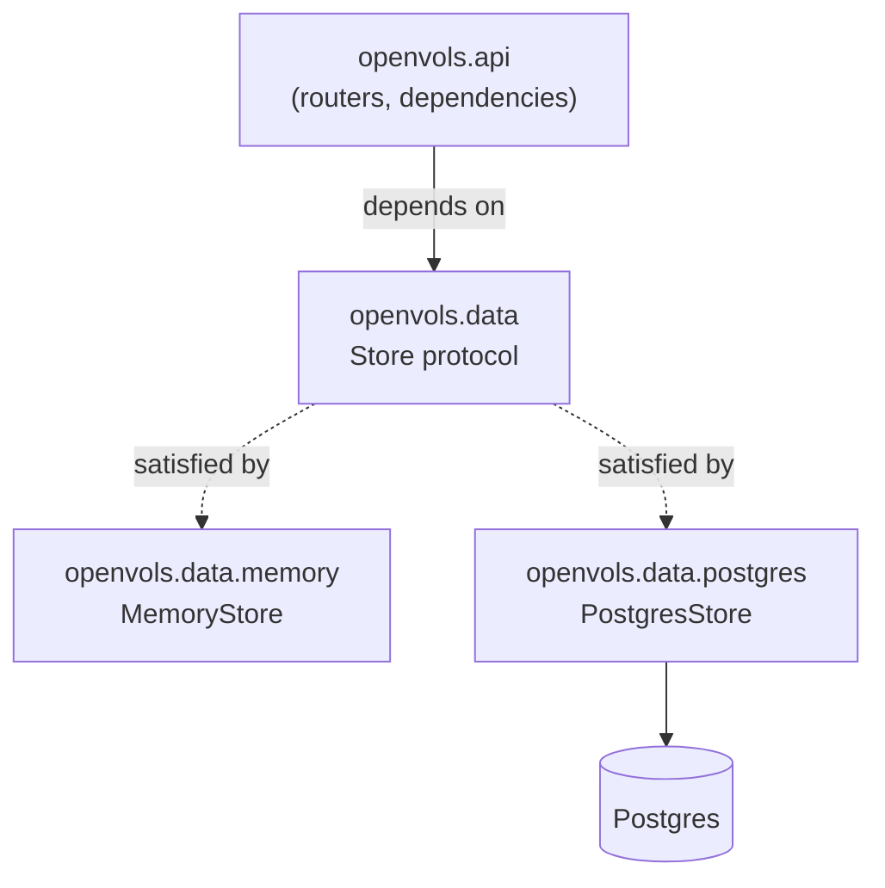

# Data Layer

## Overview

`openvols.data` is the boundary between `openvols.api` and persistence. The REST layer
depends on one abstraction -- `Store` -- and never on a specific backend. Two backends
satisfy it today: an in-memory `MemoryStore` (tests, local development) and a
`PostgresStore` (asyncpg + yoyo migrations), matching the backend choice in
[principles.md](principles.md#strong-boundaries). Adding a third backend means writing a
new package under `openvols.data` that satisfies `Store`; nothing in `openvols.api` or the
other backends needs to change.

## The abstraction

Everything the API layer is allowed to import lives in `openvols/data/__init__.py`, which
re-exports from two private sibling modules -- callers never reach into
`openvols.data._store`, `openvols.data.memory`, or `openvols.data.postgres` directly:

* **`_store.py`** -- the contract itself: `Repository[StoredT, InputT]` (a generic
  `typing.Protocol` for `create`/`get`/`list`/`update`/`delete`), one `*Repository`
  protocol per aggregate, the `Store` protocol that groups all seven as an async
  context manager, the exceptions every backend raises (`DataError`, `NotFoundError`,
  `ConflictError`), and `DataSettings` (`pydantic-settings`, env-driven backend
  selection via `OPENVOLS_DATA_BACKEND`).
* **`_factory.py`** -- `create_store(settings) -> Store`, the one place that imports
  both backend packages to pick between them.

Repository protocols are structural (`typing.Protocol`), not `abc.ABC`: a backend like
`MemoryStore` or `PostgresStore` satisfies `Store` by having matching methods, with no
inheritance from `openvols.data` required. `ParticipantRepository` deliberately does
*not* inherit `Repository`'s `create()` -- the approved-vs-waitlisted decision on
registration is a registration-engine decision, not a plain insert, so creation only
happens through `register(user_id, opportunity_id)`.

## Registration engine

`register()` and `cancel()` on `ParticipantRepository`, plus `OpportunityRepository.update()`,
implement the engine described in `specs/Registration.tla` and `specs/Waitlist.tla`:
capacity is respected on registration, and cancelling an approved participant or raising
an opportunity's capacity promotes the next waitlisted participant FIFO. Both backends
implement this logic themselves (not in a shared helper) because the concurrency control
needed to keep it correct is backend-specific.

### Postgres concurrency control

Every mutating registration-engine operation locks the opportunity row first --
`SELECT ... FOR UPDATE` -- before reading or writing any of its participants:

* `register()`: locks the opportunity, checks for an existing active registration,
  counts approved participants, inserts.
* `cancel()`: reads the participant's `opportunity_id` (immutable, safe to read
  unlocked), locks that opportunity, then promotes if the cancelled participant had
  been approved.
* `OpportunityRepository.update()`: the `UPDATE` itself takes the row lock, then
  promotion runs in the same transaction.

An advisory lock was considered and rejected: the opportunity is a real row already
being read for its `capacity`, so locking it is one extra clause on a query that's
already running, not a separate round trip; it's transaction-scoped by construction
(released automatically on commit or rollback, with nothing to unlock manually); and it
avoids hashing a UUID `id` into an advisory lock's integer key. Because it's always the
same single row locked per transaction, there's no lock-ordering deadlock to worry about.

## Model normalization

`openvols.models` originally embedded full nested objects on the write-side models
(`Location.organization: Organization`, `Opportunity.location: Location` /
`.contact: User` / `.agreements: list[Agreement]`, `Role.organization` / `.user`,
`Participant.user` / `.opportunity`). None of those nested types carry an `id`, so there
was no way for a backend to know which stored record a nested object referred to --
workable for `MemoryStore` (which could just store whatever snapshot it was given) but
incompatible with a real relational Postgres schema.

These fields were changed to id references (`organization_id: str`, `location_id: str`,
`contact_id: str`, `agreement_ids: list[str]`, `user_id`/`opportunity_id` on
`Participant`), and both backends now validate that a referenced id exists before
writing, raising `NotFoundError` if it doesn't:

* `MemoryStore`'s validation is explicit -- each repository wrapper calls `.get()` on
  the referenced repository before writing.
* `PostgresStore`'s validation is also explicit (same `.get()` calls), even though the
  schema also declares real foreign keys -- matching, precise `NotFoundError`s across
  backends was judged more valuable than parsing a driver-specific constraint
  violation. The foreign keys remain as a defense-in-depth backstop.

One consequence: a user can register, cancel, and later re-register for the same
opportunity, so participant uniqueness only applies to the *active* (non-cancelled)
registration for a given `(user_id, opportunity_id)` pair, not the full history. Both
backends enforce this and raise `ConflictError` on a duplicate active registration --
`MemoryStore` with an explicit scan, `PostgresStore` with an explicit check plus a
partial unique index (`participants_active_registration_idx ... WHERE NOT cancelled`)
as a backstop.

## Backends

### MemoryStore (`openvols/data/memory/`)

Dict-backed, no persistence across restarts, no concurrency control beyond Python's
single-threaded event loop. `_InMemoryRepository[StoredT, InputT]` is the generic CRUD
implementation shared by `organizations` and `users` (the only two aggregates with no
foreign key to validate); every other repository is a small wrapper adding FK validation
and, for `opportunities`/`participants`, the registration engine.

### PostgresStore (`openvols/data/postgres/`)

* **Schema**: `openvols/data/postgres/migrations/0001.initial-schema.sql`, applied with
  [yoyo](https://ollycope.com/software/yoyo/latest/) (`yoyo.ini` at the repo root points
  at the migrations directory; `yoyo apply` needs a sync driver, so `psycopg[binary]`
  was added alongside the app's async `asyncpg` purely for that purpose). Column names
  avoid the reserved words `start`/`end` (stored as `starts_at`/`ends_at`) without
  needing to quote them throughout the query layer. `Opportunity.agreement_ids` is
  backed by a join table, `opportunity_agreements`.
* **Query layer**: `_SimpleRepository[StoredT, InputT]` is a small generic helper for
  tables whose columns map 1:1 onto model fields with no enum conversion --
  `organizations`, `users`, `locations`, `agreements`. `roles` is written out directly
  because `RoleType` is a plain `enum.Enum` (needs an explicit `.value` on write,
  unlike `AgreementCadence`, a `StrEnum`, which asyncpg accepts directly since its
  members are `str` instances). `opportunities` and `participants` are written out
  directly because they need validation, joins, or registration-engine logic that
  doesn't fit a generic column-mapping helper.
* **Local dev**: `docker-compose.yml` at the repo root runs Postgres 17. Verified
  end-to-end against a live container: FK validation, enum round-tripping, the
  `agreement_ids` join table, capacity/waitlist behavior, `ConflictError` on duplicate
  registration, re-registration after cancel, and FIFO promotion via both `cancel()`
  and a capacity-increasing `update()`.

## API layer wiring

* **`openvols/api/dependencies.py`** -- `get_store(request)` reads the `Store` off
  `request.app.state`.
* **`openvols/api/__init__.py`** -- a `lifespan` builds the store from
  `data.DataSettings()` (defaults to the `memory` backend) and stores it on
  `app.state`; two exception handlers map `NotFoundError` to 404 and `ConflictError`
  to 409, so routers never touch HTTP status codes for those cases.
* **`openvols/api/routers.py`** -- every route now calls the real `Store` instead of
  returning fixture data. One request-shape change: `POST /api/participants` takes
  `{user_id, opportunity_id}` (a new `RegisterParticipant` model) instead of a full
  `Participant` body, matching `register()`'s signature. A new
  `POST /api/participants/{id}/cancel` route was added -- without it there was no way
  to invoke the registration engine's promotion path over HTTP at all.

## Testing

* **`tests/test_routes.py`** -- the `client` fixture now runs the app's lifespan
  (`with TestClient(...) as client`) so each test gets a fresh, empty `MemoryStore`.
  CRUD tests create a record and act on its real id instead of a hardcoded `"some-id"`.
  Fixtures for nested aggregates (`role_body`, `location_body`, `agreement_body`,
  `opportunity_body`) now create their prerequisite resources through the API and
  reference them by id, matching the normalized models. Participant tests cover
  register/get/list/update/cancel/delete plus an end-to-end waitlist-then-promote test
  through the actual HTTP routes.
* **`tests/data/`** -- a conformance suite that runs the same 10 test cases against
  *every* backend via a parametrized `store` fixture (`tests/data/conftest.py`):
  CRUD lifecycle, missing-id errors, FK validation, capacity/waitlist behavior via both
  triggers, duplicate-registration conflict, re-registration after cancel, and
  idempotent cancellation. The Postgres half is skipped (not failed) when Postgres
  isn't reachable, verified both ways. `pytest-asyncio` (`asyncio_mode = "auto"` in
  `pyproject.toml`) runs the `async def` test functions.

Full suite: 65 tests (45 route tests + 20 conformance tests across both backends),
passing with lint (`ruff check`) and formatting (`ruff format`) clean.

## Dependencies added

* `pydantic-settings` -- `DataSettings`.
* `psycopg[binary]` -- yoyo's migration runner (sync; separate from `asyncpg`, which
  the app uses at runtime).
* `pytest-asyncio` (dev) -- running the conformance suite's async tests.

## Known limitations / follow-ups

* `PostgresStore`'s foreign keys are a backstop, not load-bearing for error messages --
  if a future code path writes SQL directly instead of going through a repository, its
  errors won't be translated to `NotFoundError`/`ConflictError` automatically.
* No live "expand this id into the full nested object" convenience on read (e.g. a
  `Location` response including its `Organization` inline) -- callers currently issue a
  separate `GET` for referenced aggregates. This was an explicit simplicity tradeoff,
  not an oversight; see [principles.md](principles.md#implementation-characteristics).
* `PostgresStore` has no query result caching or read replicas; not a concern at MVP
  scale per [technical_design.md](technical_design.md#registration-engine)'s stated
  philosophy of keeping the registration path simple.
