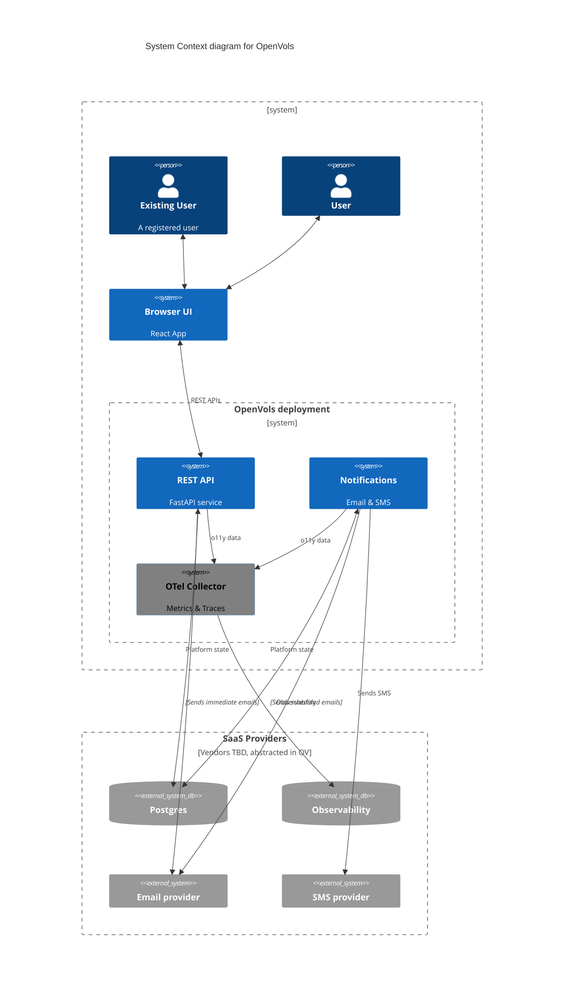

# OpenVols Technical Design

## Overview

The OpenVols system is a multi-tenant open source volunteer management platform
that focuses on providing limited friction to prospective volunteers that want
to participate in opportunities to serve their community.

## Scope

### MVP
* Organizations can join. A likely early approach is manual setup until approvals are built.
* Organizations can do CRUD operations on opportunities
* Opportunities are listed and able to auto-approve registrations and waitlist participants
  * Waitlisted participants are auto-approved FIFO as opportunity capacity opens
* Users can authenticate via email magic link and set their contact information and preferences
* Users with access to a role can assume elevated privileges, such as managing an Organization
* Users can register to participate in an opportunity, or cancel their participation
* Email notifications can be sent 48 hours in advance of the opportunity

### Likely followup scope

* Organization approval system
* Registration and waitlist approval configurations, manual vs. automatic
* SMS notifications

## System architecture

At a high level, the system includes:
Pesentation tier:
* Browser-based UI

Application tier:
* REST API service that integrates with a database and backs the UI
* Notification service that sends email and SMS reminders

Data tier:
* Relational database, e.g., Postgres

### UI

**TODO**

The UI will almost certainly use React. This is an area I know very little
about outside of my work on https://frtrails.org/, so it's not something I'm
coming into with as much thought as the backend.

### REST API

The REST API will be served by [FastAPI](https://fastapi.tiangolo.com/).

A few high level ideas:
* Authentication will be passwordless via "magic link" emails, or API keys.
* Authorization is controlled via roles that authenticated users can assume.
* Strict separation between REST layer and business logic. No code in the REST
  layer that isn't about HTTP.
* Use [Pydantic](https://pydantic.dev/docs/validation/latest/get-started/) models
* Use [OpenTelemetry](https://opentelemetry.io/docs/languages/python/)
  for metrics and tracing.
  * Use [structlog](https://www.structlog.org/en/stable/index.html) with
    [the OTel SDK](https://www.structlog.org/en/stable/frameworks.html#opentelemetry)
    to correlate logs with traces.

Most APIs here are CRUD operations without much or any logic. Add a location,
update a title, etc. One operations requires more logic: registration and the waitlist.

#### Registration engine

The main feature of this platform is transitioning interested volunteer users
to registered participants. This will happen inside the core of the REST API.

See [Registration.tla](../../specs/Registration.tla) and [Waitlist.tla](../../specs/Waitlist.tla)
for TLA+ specifications of how the registration system is designed.

> A quick aside about the _why_...
>
> The likelihood of multiple concurrent registrations and approvals, especially
> conflicting ones, is infinitesimally small for this platform. At the same time,
> the stakes of getting things wrong, such as allowing an extra participant,
> are pretty low in my experience.
>
> Keeping things simple and accepting those outcomes are normally a pretty good
> tradeoff in a business sense for something as low risk as this. Managing
> complexity is the name of the game, and adding to it unneccessarily can bring
> a lot of pain. At the same time, I'm unemployed as I'm writing this,
> I want to replace a similar system I built as a one-off (https://frtrails.org),
> and I want to learn a few things with this project. Making this more robust
> than it needs to be is a tradeoff that'll benefit myself and the users
> at some point. Plus, it's a fun side-project after all :)

In plain English, we'll be using one database table and identifying users as
**approved** or **waitlisted** in code based on their `approved` value. It's roughly
how any other waitlist works—just being explicit up front to ensure people and tools
are on the same page.
* When a user registers their participation and `capacity > 0`, they are `approved = true`
* When a user registers their participation and `capacity == 0`, they are `approved = false`,
  aka waitlisted.
* When the capacity of the opportunity rises above the count of `approved = true` participants,
  participants can be added if the count is less or equal to the new open capacity.
  This may happen due to a user canceling their participation, or by updating
  the event's capacity. Both must trigger evaluation of the wait list.
* It must be impossible to have `capacity < 0`

### Notifications

The notification system is a periodic service that finds scheduled
notifications to be sent to participants, such as email reminders for an
upcoming opportunity. The service doesn't need to be running at all times
because reminders don't need to be sent at all times, so a `cron` inspired
design is sufficient. This way deployment can happen via something like
[AWS EventBridge + Lambda](https://docs.aws.amazon.com/lambda/latest/dg/with-eventbridge-scheduler.html),
or our likely choice of Fly.io [Cron Manager](https://fly.io/docs/blueprints/task-scheduling/).

## Data model

See [openvols.models](../../src/openvols/models.py) for Pydantic-based models.

### Type boundaries

The application tier, built in Python and consisting of the REST API and Notification systems,
communicates bidirectionally with the presentation and data tiers, via layers in the system.

#### Between Python and JSON

The API layer speaks JSON to and from the UI, and does so neatly via the Pydantic models
used throughout the application tier. Nearly all strings are defined as `Field(min_length=n)`,
which don't support incoming `null`. If the UI or direct API access sends `null`, those will
be rejected during validation in the API layer.

#### Between Python and Postgres

The data layer handles all Postgres related functionality—connection pool, transactions,
and queries, along with serialization and deserialization between Postgres and Python types.
A lot of this is handled automatically by `asyncpg`'s
[type conversion](https://magicstack.github.io/asyncpg/current/usage.html#type-conversion).

What that conversion does is a 1:1 mapping to the column type, which is not always what we want.
In order to hold invariants within the Python code, we need a few translations.

| From Python | To Postgres column | Back to Python |
|-------------|--------------------|----------------|
| `"hi"`      | `TEXT NOT NULL`    | `"hi"`         |
| `"hey"`     | `TEXT` (nullable)  | `"hey"`        |
| `""`        | `TEXT` (nullable)  | `""`           |

We don't want `None` coming back from nullable columns, except in one case: Phone Numbers.
In data model there are places we use a Pydantic type called `USPhoneNumbers` that
is optionally `None`. Except for that case, strings should roundtrip through the data tier.

A little about why: Storage-wise, a nullable column takes 1 bit of the already allocated
null bitmap on a row, so it's basically free (to a point). Storing `""` is at least 1 byte.
There are also impacts from the query analyzer in how it handles these columns when they're
used in conditionals.

## REST API

### Versioning

API versioning is handled through the `X-OpenVols-API-Version` header,
which defaults to the latest if not set. The versioning scheme is date-based,
using `YYYY-MM-DD` format, such as `2026-08-17`.

### Spec

See [OpenAPI Spec](../openapi.json) for the full specification. This is available
from a running instance at the `/docs` route.

## Observability

OpenTelemetry, or OTel, will be used to observe the systems within OpenVols.
All routes should use OTel to track metrics and traces, to be collected by
an OTel Collector, and ingested by some metrics service. For the platform,
no specific metrics service is defined, so deployers can choose.

Deployments will then decide how to ingest the metrics, such as tracking SLOs.

## Testing

The backend systems should be sufficiently tested using `pytest` and any helpful
fixtures to enable unit and integration testing. FastAPI, for example, provides
its own fixtures that enable easier testing of the HTTP layer. Testing in
the data layer of the Postgres integration will require some running Postgres
instance, likely via Docker Compose. TBD.

Front testing: TBD
